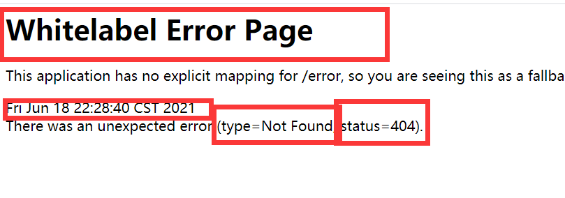
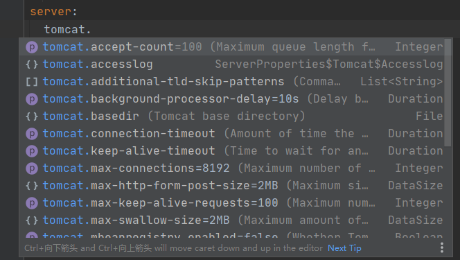
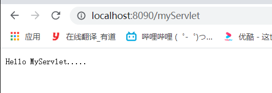
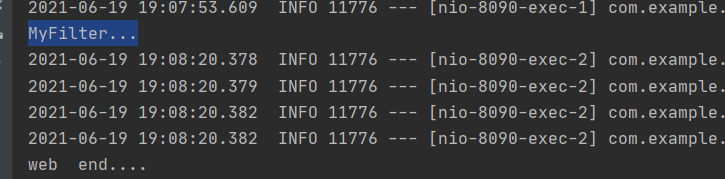
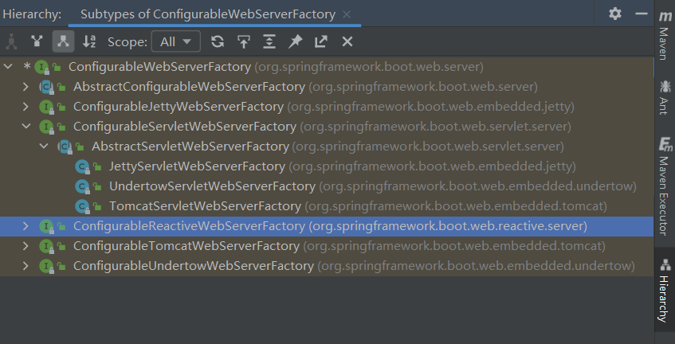
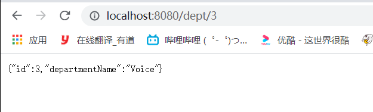
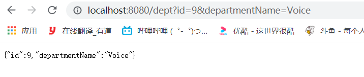
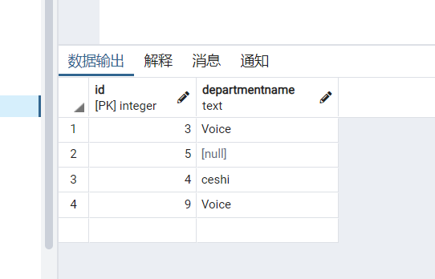

# 一、Spring Boot 入门

## 1、Spring Boot简介

> 简化Spring应用开发的新框架
>
> 整合Spring技术栈的整体整合
>
> J2EE开发的一站式解决方案

## 2、微服务

[Martin Fowler微服务文章 ](https://martinfowler.com/microservices/) 大佬写的微服务的文章，

In short, the microservice architectural style is an approach to developing a single application as a suite of small services, each running in its own process and communicating with lightweight mechanisms, often an HTTP resource API. These services are built around business capabilities and independently deployable by fully automated deployment machinery. There is a bare minimum of centralized management of these services, which may be written in different programming languages and use different data storage technologies.

-- James Lewis and Martin Fowler (2014)

简而言之，微服务架构风格是一种将单个应用程序开发成一套小型服务的方法，每个服务都在自己的进程中运行，并与轻量级机制（通常是HTTP资源API）进行通信。这些服务是围绕业务能力建立的，并且可以通过完全自动化的部署机制进行独立部署。这些服务有最低限度的集中管理，它们可以用不同的编程语言编写，并使用不同的数据存储技术。

-- James Lewis和Martin Fowler (2014)

微服务：是一种架构风格

一个应用应该是一组小型服务；可以通过HTTP的方式进行互通


早前的架构风格：单体应用

[微服务架构和单体架构的区别](https://segmentfault.com/a/1190000038319981)

## 3、环境准备

* 环境约束

  - jdk 1.8

  - maven3.x

  - IDEA、还有 Spring 官方推荐的开发工具STS

  - SpringBoot 1.5.9 ？这个不太行吧？已经升级上去了？当前开发使用的2.0.1

    ```xml
    <dependency>
       <groupId>org.mybatis.spring.boot</groupId>
       <artifactId>mybatis-spring-boot-starter</artifactId>
       <version>2.0.1.RELEASE</version>
    </dependency>
    ```

  - MAVEN设置：
    - MAVEN的setting.xml 可以修改默认的java版本

## 4、SpringBoot HelloWorld

功能：浏览器发送一个hello请求，服务器接收请求并处理，响应Hello World 字符串

### 1、创建一个maven项目

### 2、导入SpringBoot相关依赖

* **注意父项目只能写在parent节点内，写在dependency 会找不到资源，无论是下载依赖时还是执行Maven命令**

```xml
    <parent>
        <groupId>org.springframework.boot</groupId>
        <artifactId>spring-boot-starter-parent</artifactId>
        <version>2.3.3.RELEASE</version>
    </parent>
    <dependencies>
        <dependency>
            <groupId>org.springframework.boot</groupId>
            <artifactId>spring-boot-starter-web</artifactId>
            <version>2.3.9.RELEASE</version>
        </dependency>
    </dependencies>
```

快速启动的官网教程在https://start.spring.io/ ，还可以在浏览器上直接选取环境直接快速开始，生成zip包

### 3、编写一个主程序；启动SpringBoot应用

https://spring.io/quickstart  快速启动页教程上有相关代码

```java
@SpringBootApplication
@RestController
public class DemoApplication {

	public static void main(String[] args) {
		SpringApplication.run(DemoApplication.class, args);
	}

	@GetMapping("/hello")
	public String hello(@RequestParam(value = "name", defaultValue = "World") String name) {
		return String.format("Hello %s!", name);
	}
}
```

测试方式：

http://localhost:8080/hello

或者

http://localhost:8080/hello?name=amy

### 4、编写相关的Controller、Service

尚硅谷教程里面为了分层，编写Contorller和Service，这个不急后面写

### 5、测试

http://localhost:8080/hello

或者

http://localhost:8080/hello?name=amy

### 6、简化部署

打包成可执行jar，后直接java  -jar

打包依赖如下：

```xml
    <build>
        <plugins>
            <plugin>
                <groupId>org.springframework.boot</groupId>
                <artifactId>spring-boot-maven-plugin</artifactId>

            </plugin>
        </plugins>
    </build>
```

打包方式：

右上角Maven中的Package选项，估计直接使用Maven 命令也可以直接实现同样的功能

## 5、 Hello world 探究

### 1、POM文件

#### 1、父项目

* **父项目需要写在parent节点中**

```xml
<parent>
    <groupId>org.springframework.boot</groupId>
    <artifactId>spring-boot-starter-parent</artifactId>
    <version>2.3.3.RELEASE</version>
</parent>
```

其中`spring-boot-starter-parent`依赖如下   ↓  ↓     ↓  ↓ ↓ 依赖的`spring-boot-dependencies`

```xml
<parent>
    <groupId>org.springframework.boot</groupId>
    <artifactId>spring-boot-dependencies</artifactId>
    <version>2.3.3.RELEASE</version>
</parent>
```

`spring-boot-dependencies` 管理着所有Spring Boot 依赖的默认版本，所以在导入依赖的时候，可以不写版本号，那么想使用非默认版本，就需要在pom中对依赖进行版本声明

#### 2、导入依赖

````xml
<dependency>
    <groupId>org.springframework.boot</groupId>
    <artifactId>spring-boot-starter-web</artifactId>
    <version>2.3.9.RELEASE</version>
</dependency>
````

spring-boot-starter-web

* spring-boot-starter : 是Spring-Boot场景启动器
* Spring  Boot 将所有的功能场景都抽取出来，做成了一个个的starters（启动器），开发人员只需要在项目中引入这些starters，相关的场景基本依赖都会被starters导入进来，要用什么功能就导入什么场景启动器，就OK

### 2、main方法，入口类，如何实现的自动配置

```java
@RestController
@SpringBootApplication
public class DemoHelloWorld {
    public static void main(String[] args) {
        SpringApplication.run(DemoHelloWorld.class);
    }

    @GetMapping("/hello")
    public String hello(@RequestParam(value = "name", defaultValue = "World") String name) {
        return String.format("Hello %s!", name);
    }
}
```

**`@SpringBootApplication`** ：Spring Boot  应用标注在某个类上，说明这个类是SpringBoot 的主配置类，Spring就应该运行这个类的main方法来启动SpringBoot应用，


@SpringBootApplication 注解的组成：

```java
@Target({ElementType.TYPE})
@Retention(RetentionPolicy.RUNTIME)
@Documented
@Inherited
@SpringBootConfiguration
@EnableAutoConfiguration
@ComponentScan(
    excludeFilters = {@Filter(
    type = FilterType.CUSTOM,
    classes = {TypeExcludeFilter.class}
), @Filter(
    type = FilterType.CUSTOM,
    classes = {AutoConfigurationExcludeFilter.class}
)}
)
public @interface SpringBootApplication {
```

以上部分中主要部分：

@SpringBootConfiguration：

​		>@Configuration

​			>@Component- 》》 基本组件，直接扫描？

@EnableAutoConfiguration：开启自动配置功能

​	>@AutoConfigurationPackage

​		>@Import({Registrar.class})

​    > @**Import**({AutoConfigurationImportSelector.class})

Registrar类内容如下：

```java
static class Registrar implements ImportBeanDefinitionRegistrar, DeterminableImports {
        Registrar() {
        }
		// registerBeanDefinitions 注册Bean定义信息
        public void registerBeanDefinitions(AnnotationMetadata metadata, BeanDefinitionRegistry registry) {
            AutoConfigurationPackages.register(registry, (String[])(new AutoConfigurationPackages.PackageImports(metadata)).getPackageNames().toArray(new String[0]));
        }

        public Set<Object> determineImports(AnnotationMetadata metadata) {
            return Collections.singleton(new AutoConfigurationPackages.PackageImports(metadata));
        }
    }
```

==@AutoConfigurationPackage.Registrar.class:==

==作用是：将主配置类所在包以及下面所有子包中的所有组件扫描到Spring容器中，====主要是registerBeanDefinitions 这个方法==

 **↑ ↑ ↑**  以上高亮就是自动配置加载的关键所在

​	>@**Import**({AutoConfigurationImportSelector.class})

​	给容器中导入组件？

​	AutoConfigurationImportSelector：自动导入组件选择器

​	getAutoConfigurationEntry()  将所有需要导入的组件以全类名的方式返回；这些组件就会被添加到容器中，比如配置类


有了这些自动配置类，就免去了我们手动编写配置的和注入功能组件的工作；

自动配置类的来源是：

```java
SpringFactoriesLoader.loadFactoryNames(EnableAutoConfiguration.class, this.getBeanClassLoader());
```

==Spring Boot 在启动的时候从类路径`"META-INF/spring.factories"中获取了 AutoConfigurationImportSelector 指定的值，将这些值作为自动配置类导入容器中，自动配置类从而生效，帮我们进行自动配置工作；以前我们要做的配置的东西，自动配置类都帮我们配置了==

J2EE的整体解决方案和自动配置都在：`spring-boot-autoconfigure-2.3.3.RELEASE.jar`

## 6、使用Spring Assistant 进行快速创建SpringBoot 应用

[REST API](https://www.ruanyifeng.com/blog/2014/05/restful_api.html)

如果某个类中所有方法都要进行@ResponseBody声明，那么可以直接声明注解到类名上，表示该类中的所有方法都会被这个注解修饰

如果@ResponseBody 声明后，返回值是对象，还能转为JSON数据返回给浏览器

**@ResponseBody 和 @Controller 可以简化为 @RestController**

默认生成的SpringBoot 应用：

* 主程序main函数已经生成好了，后续只需要进行业务逻辑开发即可

* resources文件夹的目录结构：

  - static ： 存放静态资源文件；比如js、css、images

  - templates： 保存所有的模板界面，比如dashboard、或者404；（SpringBoot 默认是jar包使用嵌入式Tomcat，默认不支持JSP页面）；但是可以使用模板引擎，比如freemarker、thymleaf 

  - application.properties：Spring Boot应用的配置文件，默认配置可以进行修改（比如修改访问端口号，追加如下代码）

    - ```yaml
      server.port=8081
      ```

# 二、Spring Boot配置

配置文件、加载顺序、配置原理

## 1、配置文件

Spring Boot使用一个全局的配置文件，配置文件名字是固定的

* application.properties
* application.yml

配置文件的作用：修改SpringBoot自动配置的默认值

YAML文件，在之前做公司源码项目二进制化的时候，使用过，和xml一样的标记语言，但是比xml简练，以数据为中心

当application.propertie 和 application.yml 同时存在的时候，application.propertie 优先级更高？

[application.yml 和application.propertie 优先级问题](https://www.jianshu.com/p/941aee2a99cf)

## 2、YAML语法

### 1、基本语法

YAML语法没啥好学

K:(空格)V     ->表示一堆键值对

以空格来控制层级关系，只要是左对齐的一列数据，就都是同一个层级的

```yaml
server:
	port: 8081
	path: /hello
```

属性和值都是大小写敏感的

### 2、 复杂语法

[YAML菜鸟教程](https://www.runoob.com/w3cnote/yaml-intro.html)

[阮一峰的YAML文件](https://www.ruanyifeng.com/blog/2016/07/yaml.html)

[YAML在线校验和格式转换](http://nodeca.github.io/js-yaml/)

基本：

map：

数组：

对象：

### 3、 配置文件的使用场景

这里的使用场景是，使用YAML文件对Bean进行直接配置，那么有些配置场景下，就只需要修改配置文件，不需要修改代码

比如数据库连接操作？根据不同的环境选择不同的配置项?

### 4、 YAML配置文件的值得获取

yml文件如下：

```yaml
person:
  name: zhangsna
  age: 34
  mate:
    - lisi
    - 王五
  dog:
    name: 小白
    age: 7
```

java文件如下：

```java
@Component
@ConfigurationProperties(prefix = "person")
public class Person {
    private String name ;
    private int age;
    private Dog dog;
```

主要依赖注解如下，

1. @Component

2. @ConfigurationProperties(prefix = "person")

3. application.properties 也可以实现同样的功能，但是编码格式需要修改，properties 文件默认是ascII码，idea默认utf-8的编码，修改方式如下：

   setting 界面搜索file encoding

   

## 3 、配置文件值的注入

### 1、application.properties在idea中乱码的问题解决

### 2、@Value获取值和@ConfigurationProperties获取值的比较

|                | @ConfigurationProperties | @Value       |
| :------------- | :----------------------- | :----------- |
| 功能           | 批量注入配置文件中的属性 | 一个个的指定 |
| 松散绑定       | 支持                     | 不支持       |
| Spel           | 不支持                   | 支持         |
| JSR303数据校验 | 支持                     | 不支持       |
| 复杂类型封装   | 支持                     | 不支持       |

如果说，我们只是在某个业务逻辑中需要获取一下配置文件中的某项值，那么使用@Value

如果说，我们专门编写了一个JavaBean来和配置文件进行映射，我们就直接使用@ConfigurationProperties 

### 3、 配置文件注入值数据校验

举例**JSR303数据校验**：

```java
@Validated
public class Person {
    @Email
    private String name ;
```

我没解决掉这个@Email的依赖导入问题，没找着

### 4、@PropertySources 和 @ImportResource 

**@PropertySources：**指定自定义配置文件的具体位置和名称，

```java
@PropertySource(value = "classpath:person.yml")
@Configuration
@ConfigurationProperties(prefix = "person")
public class Person {
```

可以自己指定配置文件的使用


**@ImportResource**  ：导入Spring的配置文件，让配置文件中的内容生效

SpringBoot中没有Spring的配置文件，我们自己编写的配置文件，也不能自动识别；

想让Spring的配置文件生效加载进来，就需要使用**@ImportResource**标注在一个配置类上。

```java
@ImportResource(locations = {"classpath:xxx.xml "})
导入Spring的配置文件，让其生效
```

SpringBoot 推荐的给容器中添加组件的方式是：

1、配置类---》Spring配置文件 (替代关系)

2、使用@Bean给SpringBoot添加组件

##  4、配置文件占位符

### 1、随机数 

```properties
person.name=张三${random.uuid}
person.age=${random.int}
person.dog.name=${person.name}_Dog_小白 // 对成员对象的属性进行配置


my.secret=${random.value}         // 配置随机值 
my.number=${random.int}           // 配置随机整数
my.bignumber=${random.long}      // 配置随机long类型数
my.uuid=${random.uuid}            // 配置随机uuid类型数
my.number.less.than.ten=${random.int(10)}    // 配置小于10的随机整数
my.number.in.range=${random.int[1024,65536]} // 配置范围在[1024,65536]之间的随机整数
```

### 2、占位符获取之前配置过的值，如果没有可以使用：进行指定

```properties
# 随机值设置以及参数间引用配置
tom.age=${random.int[10,20]}
tom.description=tom的年龄可能是${tom.age}
```

## 5、Profile多环境配置

### 1、使用Profile文件进行多环境配置

在Spring Boot框架中，提供了使用Profile进行多环境配置的方案，但是配置文件名字必须满足applaction-{profile}.properties的命名格式，？不能以yml为后缀吗？，其中{profile}是环境表示关键字

示例如下：

```
application-dev.properties       // 开发环境配置文件
application-test.properties      // 测试环境配置文件
application-prod.properties      // 生产环境配置文件
```

使配置文件生效的方法有两种：

* 在java -jar xxx.jar 时，指定环境比如：

  - ```properties
    java -jar xxx.jar --spring.profiles.active=dev
    ```

* 直接在全局配置文件`application.properties `中进行明确，比如：

  - ```properties
    # 激活开发环境配置文件
    spring.profiles.active=dev
    ```

* 虚拟机参数设置法：
  - -Dspring.profiles.active=dev

测试方案如下：

* application-dev.properties       // 开发环境配置文件

```properties
server.port=8081
```

* application-test.properties      // 测试环境配置文件

```properties
server.port=8082
```

* application-prod.properties      // 生产环境配置文件

```properties
server.port=8083
```

### 2、使用@Profile进行多环境配置

Spring Boot 除了支持Profile文件进行多环境配置为，也支持使用@Profile注解进行多环境配置，

示例：

```java
@Profile("dev")    // 指定多环境配置类标识
public class DevDBConnector implements DBConnector {
```

* 激活环境的方式倒是和使用文件的激活方式是一样的

配合上面的配置文件值得导入，可以尝试一个，不同环境下加载不同的配置文件，进行JavaBean的配置

尝试如下：

### 3、 YAML 可以使用多代码块的方式实现多Profile的同样功能

```yaml
server:
  port: 8084
spring:
  profiles:
    active: dev

---
server:
  port: 8087
spring:
  profiles: dev

---
server:
  port: 8089
spring:
  profiles: test
```

## 6、配置文件加载位置

### 1、项目内部的配置文件

spring boot 启动会扫描以下位置的application.properties或者application.yml文件作为Spring boot的默认配置文件

```
1、–file:./config/
2、–file:./
3、–classpath:/config/
4、–classpath:/
```

以上是按照优先级从高到低(1-4)的顺序，所有位置的文件都会被加载，高优先级配置内容会覆盖低优先级配置内容。

SpringBoot会从这四个位置全部加载主配置文件，如果高优先级中配置文件属性与低优先级配置文件不冲突的属性，则会共同存在—互补配置。

另外可以通过命令行传入：

```
java -jar spring-boot-02-config-02-0.0.1-SNAPSHOT.jar --spring.config.location=D:/application.properties
```

### 2、外部配置加载顺序

[官方的解释文章](https://docs.spring.io/spring-boot/docs/1.5.9.RELEASE/reference/htmlsingle/#boot-features-external-config)

[翻译版本](https://blog.csdn.net/J080624/article/details/80508606)

## 7、自动配置原理

配置文件到底能写什么？怎么写？自动配置的原理是什么？

* 配置文件到底能写什么？：请参照[**官方文档**](https://docs.spring.io/spring-boot/docs/2.1.0.RELEASE/reference/htmlsingle/#common-application-properties)

* 尚硅谷的视频教程第19 课，视频教程

# 三、Spring Boot 与 日志框架

## 1、日志框架

市面上常见的日志框架：

JUL、JCL、Jboss-logging、logback、log4j、log4j2、slf4j....

| 日志门面（日志的抽象层）              | 日志实现                            |
| ------------------------------------- | ----------------------------------- |
| ~~JCL~~、~~Jboss-logging~~、**slf4j** | ~~log4j、JUL、log4j2、~~**LogBack** |

SpringBoot：底层是Spring框架，Spring框架默认使用JCL

​	SPringBoot选用的是：**slf4j** 和 **LogBack**

## 2、SLF4J的使用

### 1、如何在系统中使用SLF4J

[SLF4J官网](http://www.slf4j.org/)

使用方法：

```java
import org.slf4j.Logger;
import org.slf4j.LoggerFactory;

public class HelloWorld {
  public static void main(String[] args) {
    Logger logger = LoggerFactory.getLogger(HelloWorld.class);
    logger.info("Hello World");
  }
}
```

### 2、遗留问题、其他日志框架统一转换为SLF4J

### 3、Spring Boot 日志关系

依赖关系啥的，

### 4、日志的使用

#### 1、常用log配置

```yaml
logging:
  level:
    com:
      example:
        demo: error

  file:
#    path: C:\Users\changhengyu-PC\Desktop\SpringBootLearn\demo_2
#    path: logs
#    path: log
#    name: my.log
    name: logs/lab.log
#    name: D:/logs/lab.log
```

[高版本的Log等级，输出路径的配置教程](https://segmentfault.com/a/1190000022318320)

log输出到控制台和文件中的默认格式都是可以修改的，代码示例；

* logging.pattern.console

```
%clr(%d{${LOG_DATEFORMAT_PATTERN:-yyyy-MM-dd HH:mm:ss.SSS}}){faint} %clr(${LOG_LEVEL_PATTERN:-%5p}) %clr(${PID:- }){magenta} %clr(---){faint} %clr([%15.15t]){faint} %clr(%-40.40logger{39}){cyan} %clr(:){faint} %m%n${LOG_EXCEPTION_CONVERSION_WORD:-%wEx}
```

* logging.pattern.file

```
%d{${LOG_DATEFORMAT_PATTERN:-yyyy-MM-dd HH:mm:ss.SSS}} ${LOG_LEVEL_PATTERN:-%5p} ${PID:- } --- [%t] %-40.40logger{39} : %m%n${LOG_EXCEPTION_CONVERSION_WORD:-%wEx}
```

原有的默认配置在：

#### 2、指定自己的Log配置文件

再类路径下放上每个日志框架自己的配置文件，SpringBoot就不使用自己的默认配置了

官方手顺路径：[官方手顺路径](https://docs.spring.io/spring-boot/docs/2.1.0.RELEASE/reference/htmlsingle/#using-boot-devtools-restart-logging-condition-delta)

| Logging System          | Customization                                                |
| ----------------------- | ------------------------------------------------------------ |
| Logback                 | `logback-spring.xml`, `logback-spring.groovy`, `logback.xml`, or `logback.groovy` |
| Log4j2                  | `log4j2-spring.xml` or `log4j2.xml`                          |
| JDK (Java Util Logging) | `logging.properties`                                         |

Logging支持多环境配置，官方方案[官方方案](https://docs.spring.io/spring-boot/docs/2.1.0.RELEASE/reference/htmlsingle/#using-boot-devtools-restart-logging-condition-delta)

比如`logback-spring.xml`,`logback.xml`, 的区别

`logback.xml`,直接就被日志框架所识别

`logback-spring.xml`,这样的命名方式加载方式是由SpringBoot加载，从而实现多环境配置Profile，可以对不同额工作环境进行日志配置，比如开发环境随便输出，但是生产环境就不行


# 四、Spring Boot与WEB 开发

## 1、简介  使用Spring Boot

1）、创建SpringBoot应用，选中我们需要的模块

2）、SpringBoot已经默认将这些场景配置好了、只需要在配置文件中指定少量配置，就可以运行起来

3）、自己编写业务逻辑代码就OK

**自动配置原理这节课**，还是非常重要

这个场景SpringBoot帮我们配置了什么？能不能修改，能修改哪些配置，能不能进行扩展？

```
xxxMybatisAutoConfiguration:帮我们给容器中自动配置组件；
xxxMybatisProperties:配置类来封装配置文件中的内容；
```

以Mybatis 自动配置为例：

整体自动配置类`MybatisAutoConfiguration` 在`mybatis-spring-boot-autoconfigure-2.2.0.jar`这个jar包中

但是类的所属包是：**package org.mybatis.spring.boot.autoconfigure;** 所以我认为大部分的自动配置都应该在`spring-boot-autoconfigure-2.5.0.jar`；

第一步：

```java
@EnableConfigurationProperties({MybatisProperties.class})
// 通过ConfigurationProperties 注解，将 MybatisProperties 配置类声明过来
@AutoConfigureAfter({DataSourceAutoConfiguration.class, MybatisLanguageDriverAutoConfiguration.class})
public class MybatisAutoConfiguration implements InitializingBean {
```

第二步：把配置文件中的`mybatis`想过内容，

```java
@ConfigurationProperties(prefix = "mybatis")
public class MybatisProperties {
    public static final String MYBATIS_PREFIX = "mybatis";
```

第三步：application.yaml或者application.properties 对 `mybatis` 进行设置从而生效

上面所说的`能不能修改，能修改哪些配置，能不能进行扩展？`就是里进行application.properties 进行配置，哪些能进行配置，官网上已经给出了文档，具体内容在本比较的`7、自动配置原理` 也有记载，

https://docs.spring.io/spring-boot/docs/2.1.0.RELEASE/reference/htmlsingle/#common-application-properties

-----

Bootstrap 模板官网dowm资源    https://getbootstrap.com/

## 2、SpringBoot 对静态资源的映射规则

映射自动配置在`WebMvcAutoConfiguration`类中addResourceHandlers方法中，主要add 两部分,

```java
      // 资源文件扫面的路径获取
	  public void addResourceHandlers(ResourceHandlerRegistry registry) {
            if (!this.resourceProperties.isAddMappings()) {
                logger.debug("Default resource handling disabled");
            } else {
                this.addResourceHandler(registry, "/webjars/**", "classpath:/META-INF/resources/webjars/");
                this.addResourceHandler(registry, this.mvcProperties.getStaticPathPattern(), (registration) -> {
                    registration.addResourceLocations(this.resourceProperties.getStaticLocations());
                    if (this.servletContext != null) {
                        ServletContextResource resource = new ServletContextResource(this.servletContext, "/");
                        registration.addResourceLocations(new Resource[]{resource});
                    }

                });
            }
        }

        private void addResourceHandler(ResourceHandlerRegistry registry, String pattern, String... locations) {
            this.addResourceHandler(registry, pattern, (registration) -> {
                registration.addResourceLocations(locations);
            });
        }

		// 欢迎页面的获取
        private Resource getIndexHtml(Resource location) {
            try {
                Resource resource = location.createRelative("index.html");
                if (resource.exists() && resource.getURL() != null) {
                    return resource;
                }
            } catch (Exception var3) {
            }

            return null;
        }
		// 更换网页图标
```

主要add 两部分如下，就是webjars 下的资源和本地的资源 **mvcProperties.getStaticPathPattern()**中配置资源文件扫描路径

```java
this.addResourceHandler(registry, "/webjars/**", "classpath:/META-INF/resources/webjars/");
this.addResourceHandler(registry, this.mvcProperties.getStaticPathPattern(), (registration)
```

1）、所有"/webjars/**"， 都去"classpath:/META-INF/resources/webjars/" 找资源

​	webjars：以jar包方式引入静态资源

https://www.webjars.org/


http://localhost:8080/webjars/jquery/3.5.0/jquery.js

访问的时候想这样使用上述的静态资源，只需要在pom 加入依赖，依赖的写法，只需要在 https://www.webjars.org/ 进行查看添加即可

```xml
		如下追加webjars 的相关依赖
		<dependency> 
			<groupId>org.webjars</groupId>
			<artifactId>jquery</artifactId>
			<version>3.5.0</version>
		</dependency>
```

2）、加载自己项目中的静态资源文件

```java
this.addResourceHandler(registry, this.mvcProperties.getStaticPathPattern(), (registration)-> {
                    registration.addResourceLocations(this.resourceProperties.getStaticLocations());
```

```
getStaticPathPattern  -->>  this.staticPathPattern = "/**";
```

```
resourceProperties.getStaticLocations() -->> 
new String[]{"classpath:/META-INF/resources/", "classpath:/resources/", "classpath:/static/", "classpath:/public/"};
```

以上就是自己项目的静态资源文件的扫描路径：

```java
"classpath:/META-INF/resources/", 
"classpath:/resources/", 
"classpath:/static/", 
"classpath:/public/"
还有项目的根路径
```

3）、 欢迎页的设置

4）、网页图标的设置

直接放文件就行，但是Google 测试没有显示出来，IE 浏览器却显示出来了，很奇怪

诶？后续使用Ctrl+F5 GooGle浏览器也能刷出图标了

## 3、模板引擎

JSP、Freemarker、Thymelf、Velocity

Spring Boot 推荐的Thymelf 模板引擎 https://www.thymeleaf.org/index.html

模板引擎相关博文：https://www.cnblogs.com/dojo-lzz/p/5518474.html


### 1、引入Thymelf

```xml
		<dependency>
			<groupId>org.springframework.boot</groupId>
			<artifactId>spring-boot-starter-thymeleaf</artifactId>
		</dependency>
```

但是没有找到自动配置的AutoConfig文件，感觉套路和SpringBoot 1 略有变化，

或者可能需要进行设置，经过测试，以下配置还是默认的

```properties
#路径
spring.thymeleaf.prefix=classpath:/templates/
#后缀
spring.thymeleaf.suffix=.html
#编码
spring.thymeleaf.encoding=UTF-8spring.thymeleaf.mode=HTML5
```

具体配置文件类在，`ThymeleafProperties` 中，上面的测试下来的不需要设置也可以直接默认的值就是在下面的配置类中设置的默认值

```java
@ConfigurationProperties(prefix = "spring.thymeleaf")
public class ThymeleafProperties {
    private static final Charset DEFAULT_ENCODING;
    public static final String DEFAULT_PREFIX = "classpath:/templates/";
    public static final String DEFAULT_SUFFIX = ".html";
    private boolean checkTemplate = true;
    private boolean checkTemplateLocation = true;
    private String prefix = "classpath:/templates/"; // 前缀
    private String suffix = ".html";			    // 后缀
    private String mode = "HTML";
    // 就是说，只要我们把HTML文件放在"classpath:/templates/" 路径下，Thymelf 引擎就能自动渲染 
```

### 2、Thymelf使用& 语法

```java
	@RequestMapping("/success")
	public ModelAndView  success(){
		ModelAndView modelAndView=new ModelAndView();
		modelAndView.setViewName("success");
		List<String> list=new ArrayList<String>();
		list.add("zhangsan");
		list.add("李四");
		list.add("无敌毫克");
		modelAndView.addObject("list",list);
		return modelAndView;
	}
```

**modelAndView.setViewName("success");** 设置的名字就是对应的模板路径下的Html 文件名字

对应的html 文件如下：

```html
<!DOCTYPE html>
<!-- 生命名词空间，方便进行提醒补足 -->
<html xmlns:th="http://www.thymeleaf.org">
<html lang="en">
<head>
    <meta charset="UTF-8">
    <title>成功</title>
</head>
<body>
    <table border="1px">
        <tr>
            <th>name</th>
        </tr>
        <tr th:each="name:${list}">
            <td th:text="${name}"></td>
        </tr>
    </table>
</body>
</html>
```

测试结果如下：


## 4、SpringMVC自动配置

### 1、Spring MVC auto-configuration

官网上的情报来源如下：

https://docs.spring.io/spring-boot/docs/2.1.0.RELEASE/reference/htmlsingle/#boot-features-spring-mvc

Spring Boot provides auto-configuration for Spring MVC that works well with most applications.

**Spring Boot为Spring MVC提供了自动配置功能，对大多数应用程序都很适用。**

The auto-configuration adds the following features on top of Spring’s defaults:

**自动配置内容如下**

- Inclusion of `ContentNegotiatingViewResolver` and `BeanNameViewResolver` beans.
  - 自动配置了`ViewResolver` （即视图解析器：根据方法的返回值得到视图对象(View)，视图对象决定如何进行渲染（渲染包括？转发？重定向？））

    - 源码路径在`WebMvcAutoConfiguration`类中

  - `ContentNegotiatingViewResolver`：组合所有的视图解析器，实现代码如下

    

  - 如何定制ViewResolver？：我们可以自己给容器中注入一个视图解析器，ContentNegotiatingViewResolver 就汇会将其自动组合进来

- Support for serving static resources, including support for WebJars (covered [later in this document](https://docs.spring.io/spring-boot/docs/2.1.0.RELEASE/reference/htmlsingle/#boot-features-spring-mvc-static-content))).静态资源文件夹和webjars的默认配置

- Automatic registration of `Converter`, `GenericConverter`, and `Formatter` beans.

  - `Converter`：转化器；适用于浏览器提交的文本内容向其他类型进行转化的工具类，

  - `Formatter`：格式化器；2021-6-6 --》Date 字符串格式化成为日期类型的数据->默认配置通过`mvcProperties`获取，通过properties文件可以进行设置

    ```java
    @ConfigurationProperties(prefix = "spring.mvc")
    public class WebMvcProperties {
    	/** @deprecated */
        @Deprecated
        @DeprecatedConfigurationProperty(replacement = "spring.mvc.format.date")
        public String getDateFormat() {
            return this.format.getDate();
        }
    ```

  - ==自己添加的格式化转换器，和上面的`ViewResolver` 一样，直接注册到容器中即可==，默认的格式化器可以通过配置文件进行修改，如下

    - ``` yaml
      spring:
        mvc:
          format:
            date: 
      ```

- Support for `HttpMessageConverters` (covered [later in this document](https://docs.spring.io/spring-boot/docs/2.1.0.RELEASE/reference/htmlsingle/#boot-features-spring-mvc-message-converters)).

  - `HttpMessageConverters` Spring MVC 用来转换Http请求和响应的；比如服务端返回一个User对象经过Http在浏览器上显示一端JSON，就是这样的过程
  - `HttpMessageConverters`是从容器中获取的所有的`HttpMessageConverters`

- Automatic registration of `MessageCodesResolver` (covered [later in this document](https://docs.spring.io/spring-boot/docs/2.1.0.RELEASE/reference/htmlsingle/#boot-features-spring-message-codes)).

  - 定义错误代码生成规则；默认配置的修改方式

    - ``` yaml
      spring:
        mvc:
          message-codes-resolver-format:
      ```

- Static `index.html` support.  静态首页的默认配置支持

- Custom `Favicon` support (covered [later in this document](https://docs.spring.io/spring-boot/docs/2.1.0.RELEASE/reference/htmlsingle/#boot-features-spring-mvc-favicon)). 静态资源的默认图标配置

- Automatic use of a `ConfigurableWebBindingInitializer` bean (covered [later in this document](https://docs.spring.io/spring-boot/docs/2.1.0.RELEASE/reference/htmlsingle/#boot-features-spring-mvc-web-binding-initializer)).

  - ```java
    protected ConfigurableWebBindingInitializer getConfigurableWebBindingInitializer(FormattingConversionService mvcConversionService, Validator mvcValidator) {
    	try {
    		return (ConfigurableWebBindingInitializer)this.beanFactory.getBean(ConfigurableWebBindingInitializer.class);
    	} catch (NoSuchBeanDefinitionException var4) {
    		return super.getConfigurableWebBindingInitializer(mvcConversionService, mvcValidator);
    	}
    }
    ```

  - ==如上代码可以知道我们可以自己配置一个`ConfigurableWebBindingInitializer`来替换默认的== (添加组件的方式即可，@Bean、@Component、@Configuration都可以)

  - 即使我们没有进行设置，也会调用`super.getConfigurableWebBindingInitializer`，来进行WebData数据初始化

  - ==WebData数据初始化 作用->>>>>**把 请求数据绑定到JavaBean中**==

  - `WebData`初始化代码如下，


**==org.springframework.boot.autoconfigure.web : web 所有的自动配置场景==**

If you want to keep Spring Boot MVC features and you want to add additional [MVC configuration](https://docs.spring.io/spring/docs/5.1.2.RELEASE/spring-framework-reference/web.html#mvc) (interceptors, formatters, view controllers, and other features), you can add your own `@Configuration` class of type `WebMvcConfigurer` but **without** `@EnableWebMvc`. If you wish to provide custom instances of `RequestMappingHandlerMapping`, `RequestMappingHandlerAdapter`, or `ExceptionHandlerExceptionResolver`, you can declare a `WebMvcRegistrationsAdapter` instance to provide such components.

If you want to take complete control of Spring MVC, you can add your own `@Configuration` annotated with `@EnableWebMvc`.

### 2、扩展Spring MVC

==you can add your own `@Configuration` class of type `WebMvcConfigurer` but **without** `@EnableWebMvc`.==

**==可以编辑一个自己的`@Configuration` 类 ，`WebMvcConfigurer`类型的，不标注`@EnableWebMvc`.==**

```java
@Component
public class Myconfig implements WebMvcConfigurer {
    @Override
    public void addViewControllers(ViewControllerRegistry registry) {
        registry.addViewController("/ttt").setViewName("dashboard");
        registry.addViewController("/hhh").setViewName("dashboard");
    }

    @Override
    public void addResourceHandlers(ResourceHandlerRegistry registry) {
    }
}
```

1)、WebMvcAutoConfiguration 类是SpringMVC自动配置类

。。。。。

。。。。。

### 3、全面接管SpringMVC

背景SpringBoot 对SpringMVC 的所有自动配置我们都不需要了，所有的组件我们都自己配置，

只需要在配置类中添加`@EnableWebMvc`即可，声明后SpringMVC 相关的自动配置都会失效

失效的代码实现是：

1)、

```java
@Import({DelegatingWebMvcConfiguration.class})
public @interface EnableWebMvc {
}
```

2、

```java
@Configuration(roxyBeanMethods = false)
public class DelegatingWebMvcConfiguration extends WebMvcConfigurationSupport {
```

3、

```java
@ConditionalOnClass({Servlet.class, DispatcherServlet.class, WebMvcConfigurer.class})
// 重点在这一句ConditionalOnMissingBean， 容器中没有WebMvcConfigurationSupport 类实例时候，当前被注释的自动配置类才能生效
@ConditionalOnMissingBean({WebMvcConfigurationSupport.class})
@AutoConfigureOrder(-2147483638)
@AutoConfigureAfter({DispatcherServletAutoConfiguration.class, TaskExecutionAutoConfiguration.class, ValidationAutoConfiguration.class})
public class WebMvcAutoConfiguration {
```

4、`@EnableWebMvc`将`WebMvcConfigurationSupport`导入进来，使自动配置失效

5、导入的`WebMvcConfigurationSupport`知识SpringMVC最基本的功能

## 5、如何修改Spring Boot的默认配置

模式 套路：

​		1）、SpringBoot在自动配置很多组件的时候，先判断容器中是否有用户自己配置的相关组件，如果有就用用户自己配置的，如果没有才进行自动配置；如果组件如需存在多个(比如视图解析器`ViewResolver`)，则将用户配置的和自己默认的组合起来

​		2）、在SpringBoot中会有非常多的`xxxConfigurer`帮我们进行扩展配置

​		3）、在SpringBoot中会有非常多的`xxxxCustomizer`帮我们进行定制配置

## 6、开始进行CRUD，RestFul类型

大致需求：

* 默认访问首页index

### 1)、默认访问页面的设置

### 2）、国际化设置、

### 3）、登录

模板引擎页面修改以后想要实时生效，

1）、禁用模板引擎的缓存

```yaml
#  禁用thymeleaf 缓存
spring:
  thymeleaf:
    cache: false
```

2）、页面修改完以后、重新编译  快捷键Ctrl+F9


#### 登录错误的消息提示

html 中加上一个一个标签，可以配合thymelf 的  if  判断进行使用，就可以决定最终渲染的时候是否产生这个标签的内容

```html
<p style="color : red " th:text="${msg}" th:if="${not #strings.isEmpty(msg)}"> 错误提示可通过判断去除 </p>
```

配合使用的JAVA代码

```java
{
    // 登录失败
    logger.info("登录失败");
    module.setStatus(HttpStatus.I_AM_A_TEAPOT);
    module.addObject("msg","I_AM_A_TEAPOT，我是个茶壶的错误");
    module.setViewName("index");
}
```

### 防止表单重复提交

```java
			// 登录成功 ， 为了防止表单重复提交，可以使用重定向的方法
			// module.setViewName("dashboard");
			module.setViewName("redirect:/main.html");
```

给重定向的内容进行视图映射

```java
@Override
public void addViewControllers(ViewControllerRegistry registry) {
    registry.addViewController("/main.html").setViewName("dashboard");
}
```

### 4）、拦截器机制进行登录检查，对没有登录的用户进行登录页面的跳转

Step 1、创建自定义的拦截器

```java
public class LoginHandlerInterceptor implements HandlerInterceptor {
    @Override
    public boolean preHandle(HttpServletRequest request, HttpServletResponse response, Object handler) throws Exception {
        return false;
    }
}
```

Step 2、登录状态检查

怎么检查登录状态呢？

需要结合登录页面提交表单的请求，可以把登录好的用户通过HttpSession 获取后存放起来，在登录检查时使用，

```java
	@PostMapping(value = "/user/login")
	public ModelAndView login(@RequestParam("email") String name,
							  @RequestParam("password") String password,
							  HttpSession session) {
		//   通过 session 保存登录时输入的用户名，
        session.setAttribute("loginUser", name);
```

登录状态检查，在自定义的拦截器`LoginHandlerInterceptor`中进行逻辑实装，**==preHandle 什么意思？ 什么叫目标方法执行之前？==**

```java
    public boolean preHandle(HttpServletRequest request, HttpServletResponse response, Object handler) throws Exception {
        Object loginUser = request.getSession().getAttribute("loginUser");
        if (loginUser == null ){
            // 没有登录或者登录失败的，需要回转到登录页面
            // 先获取转发器，转发到登陆页面
            request.getRequestDispatcher("/").forward(request, response);
            // 转发的同时需要在页面中显示错误消息
            request.setAttribute("msg", "登录拦截器校验失败，需要先进行登录，我是一个茶壶");
            return false;
        } else {
            // 已经登录，不需要进行拦截，直接放行即可
            return true;
        }
    }
```

需要在配置类 ` Myconfig implements WebMvcConfigurer `中进行拦截器配置

```java
    @Override
    public void addInterceptors(InterceptorRegistry registry) {
        // addPathPatterns("/**") 拦截任意多层下的任意请求，
        // excludePathPatterns 排除我们不想被拦截的请求
        registry.addInterceptor(loginHandlerInterceptor).addPathPatterns("/**").excludePathPatterns("/", "index.html", "/user/login", "/ttt");
    }
```

* Spring Boot 2 中拦截器需要把静态资源文件排除在外？？？这个点需要注意，如果静态资源不生效的话看，可能是被拦截了
* 怎么感觉 两个浏览器对于拦截器表现不一样呢？是因为缓存的事情？
* 资源引入，公共资源可以使用webjars 和 thymelf 配合的方式进行引入

### 5、CRUD-员工列表

实验基本要求 

#### 1）、RestFulCRUD

CRUD满足Rest风格   REST (Representational State Transfer )

URI : /资源名称/资源标识     再以HTTP请求方式区分对资源的CRUD的操作

|      | 普通的CRUD               | RestFul风格 CRUD   |
| ---- | ------------------------ | ------------------ |
| 查询 | getEmp                   | emp--->GET         |
| 添加 | addEmp?xxx               | emp--->POST        |
| 修改 | updateEmp?id=xxx&xxx=xxx | emp/{id}--->PUT    |
| 删除 | deleteEmp?id=xx          | emp/{id}--->DELETE |

#### 2）、实验的请求架构；

| 对应功能                           | 请求URI <br/> /资源名称/资源标识 | 请求方式 |
| ---------------------------------- | :------------------------------: | :------: |
| 查询所有员工                       |               emps               |   GET    |
| 查询某个员工(来到修改页面操作)     |             emp/{id}             |   GET    |
| 点击按钮先来到添加页面             |               emp                |   GET    |
| 添加员工                           |               emp                |   POST   |
| 来到修改页面(查出员工进行信息回显) |             emp/{id}             |   GET    |
| 修改员工信息                       |               emp                |   PUT    |
| 删除员工                           |             emp/{id}             |  DELETE  |

#### 3）、员工列表-->公共页抽取和引入

整个dashboard界面左侧的导航栏是公共页面，thymlf提供了公共页面提取方式，在 官方教程**8 Template Layout**  这里

通过抽取bar 的方式和判断数据的方式实现不同页面不同btn 高亮

公共页面抽取

```html
<nav id="sidebarMenu" class="col-md-3 col-lg-2 d-md-block bg-light sidebar collapse" th:fragment="copy">
```

引入时候进行数据确定、主页面的对数据onevar的传值

```html
<nav th:replace="sidebar::copy (onevar=main.html)"> </nav>
```

员工列表页面对数据onevar的传值

```html
<nav th:replace="sidebar::copy (onevar=emps)"> </nav>
```

然后在公共抽取出的页面中进行数据的判断

```html
<a class="nav-link active" th:class="${onevar=='main.html'?'nav-link active':'nav-link'}" aria-current="page" href="#" th:href="main.html">
&&&&&&&&
<a class="nav-link" th:class="${onevar=='emps'?'nav-link active':'nav-link'}" href="#" th:href="@{/emps}" method="get">
```

CRUD 机能都已经实现，参照别人的博客也可以很好的备忘https://www.cnblogs.com/Mrchengs/p/10354884.html


## 7、错误处理机制

###  1、Spring Boot 默认的错误处理机制

不同的请求方式返回了不同的数据，是因为请求的头不同

 #### 1）、浏览器默认的效果，如图返回一个默认的错误页面：



#### 2）、其他客户端返回默认的Json 数据

具体原理：

​		可以参照错误处理的自动配置类：ErrorMvcAutoConfiguration 

##### 1、在容器中添加了以下组件：

```java
1、DefaultErrorAttributes 		默认的错误属性？
2、BasicErrorController			基本错误控制器
3、ErrorPageCustomizer			错误页面自定义器
4、DefaultErrorViewResolver		默认的错误视图解析器
```

具体代码如下：

```java
    @Bean
    // ConditionalOnMissingBean 判断容器中是否已经包含该组件，如果没有则自动注入
    @ConditionalOnMissingBean(
        value = {ErrorAttributes.class},
        search = SearchStrategy.CURRENT
    )
    public DefaultErrorAttributes errorAttributes() {
        return new DefaultErrorAttributes();
    }

    @Bean
    // ConditionalOnMissingBean 判断容器中是否已经包含该组件，如果没有则自动注入
    @ConditionalOnMissingBean(
        value = {ErrorController.class},
        search = SearchStrategy.CURRENT
    )
    public BasicErrorController basicErrorController() {
    }

    @Bean
    public ErrorMvcAutoConfiguration.ErrorPageCustomizer errorPageCustomizer()

        @Bean
        @ConditionalOnBean({DispatcherServlet.class})
        @ConditionalOnMissingBean({ErrorViewResolver.class})
        DefaultErrorViewResolver conventionErrorViewResolver() {
            return new DefaultErrorViewResolver(this.applicationContext, this.resources);
        } 
```

差分不同类型请求响应的代码在：

```java
@Controller
@RequestMapping({"${server.error.path:${error.path:/error}}"})
public class BasicErrorController extends AbstractErrorController {
    private final ErrorProperties errorProperties;

    @RequestMapping(
        produces = {"text/html"} // 产生Html类型的数据，浏览器的错误请求走这个方法进行处理
    )
    public ModelAndView errorHtml(HttpServletRequest request, HttpServletResponse response) {
        HttpStatus status = this.getStatus(request);
        Map<String, Object> model = Collections.unmodifiableMap(this.getErrorAttributes(request, this.getErrorAttributeOptions(request, MediaType.TEXT_HTML)));
        response.setStatus(status.value());
        // 设置 ModelAndView 决定去哪一个错误页面，包含了页面地址和页面内容
        ModelAndView modelAndView = this.resolveErrorView(request, response, status, model);
        return modelAndView != null ? modelAndView : new ModelAndView("error", model);
    }

    @RequestMapping		//  产生Json 数据
    public ResponseEntity<Map<String, Object>> error(HttpServletRequest request) {
        HttpStatus status = this.getStatus(request);
        if (status == HttpStatus.NO_CONTENT) {
            return new ResponseEntity(status);
        } else {
            Map<String, Object> body = this.getErrorAttributes(request, this.getErrorAttributeOptions(request, MediaType.ALL));
            return new ResponseEntity(body, status);
        }
    }
```


默认的处理的步骤：

​		一旦系统出现4xx或者5xx的错误，ErrorPageCustomizer就会生效(开始定制错误的响应规则)；就会来到/error请求，；就会被BasicErrorController处理；

1）、响应页面：

```java
// 设置 ModelAndView 决定去哪一个错误页面，包含了页面地址和页面内容
ModelAndView modelAndView = this.resolveErrorView(request, response, status, model);
// 这里调用了 resolveErrorView 方法，是从所有的ErrorViewResolvers中取得的modelAndView，所以还是DefaultErrorViewResolver 决定了最终的页面
protected ModelAndView resolveErrorView(HttpServletRequest request, HttpServletResponse response, HttpStatus status, Map<String, Object> model) {
        Iterator var5 = this.errorViewResolvers.iterator();

        ModelAndView modelAndView;
        do {
            if (!var5.hasNext()) {
                return null;
            }

            ErrorViewResolver resolver = (ErrorViewResolver)var5.next();
            modelAndView = resolver.resolveErrorView(request, status, model);
        } while(modelAndView == null);

        return modelAndView;
    }
```


#### 3）、如何定制错误响应，

##### 1、如何定制错误页面

###### 1、有模板引擎的情况下；直接在模板路径下添加文件  error/404.html

###### 2、可以使用4xx和5xx 作为错误页面的文件来匹配这种类型的所有错误 ，原则是精确优先

 

##### 2、 如何定制默认的Json 数据

## 8、配置嵌入式Servlet容器

SpringBoot 默认是使用的嵌入式的Servlet容器（Tomcat）；

问题 ？

##### 1）、如何定制和修改Servlet容器相关默认配置；

###### 方法1、修改和server有关的配置

```yaml
server.port=8088
server.servlet.context-path:curd 

通用的Servlet容器设置：
server.xxx=xxx
Tomcat的设置
server.tomcat.xxx=xxx
```



实现方式：TomcatServletWebServerFactoryCustomizer 加载了ServerProperties 配置类

```java
public class TomcatServletWebServerFactoryCustomizer implements WebServerFactoryCustomizer<TomcatServletWebServerFactory>, Ordered {
    private final ServerProperties serverProperties;
```

```java
@ConfigurationProperties(
    prefix = "server",
    ignoreUnknownFields = true
)
public class ServerProperties {
    private Integer port; // 这不就是常见的端口号的配置么
```

###### 方法2、自己编写一个 WebServerFactoryCustomizer 这个类的实现，注册到容器中应该就可以将修改默认配置 

```java
    @Bean
    public WebServerFactoryCustomizer webServerFactoryCustomizer() {
        return new WebServerFactoryCustomizer<ConfigurableWebServerFactory>() {

            // 定制嵌入式Servlet容器的相关规则
            @Override
            public void customize(ConfigurableWebServerFactory factory) {
                factory.setPort(8090);
            }
        };
    }
```

#### 2）、自己注册Servlet的三大组件【Servlet、Filter、Listener】

由于SpringBoot默认是以jar包的方式启动嵌入式的Servlet容器来启动SpringBoot的web应用，没有web.xml文件

 所以注册三大组件使用以下三个类即可：

**ServletRegistrationBean** 用于注册**Servlet**，使用方法如下：

自己实现一个Sevelet类 

```java
public class MyServlet extends HttpServlet {
    @Override
    protected void doPost(HttpServletRequest req, HttpServletResponse resp) throws ServletException, IOException {
		resp.getWriter().write("Hello MyServlet.....");
    }
    @Override
    protected void doGet(HttpServletRequest req, HttpServletResponse resp) throws ServletException, IOException {
       doPost(req,resp);
    }
}
```

ServletRegistrationBean实现Servlet加入容器

```java
@Configuration
public class MyServletConfig {
    //注册三大组件
    @Bean
    public ServletRegistrationBean servletRegistrationBean(){
        // public ServletRegistrationBean(T servlet, String... urlMappings)
        ServletRegistrationBean re = new ServletRegistrationBean(new MyServlet(),"/myServlet");
        return  re;
    }
}
```

效果如下图，/myServlet、不会被SpringBoot 的过滤器拦截掉




**FilterRegistrationBean**

实现**Filter**

```java
public class MyFilter implements Filter {
    @Override
    public void doFilter(ServletRequest servletRequest, ServletResponse servletResponse, FilterChain filterChain) throws IOException, ServletException {
        System.out.println("MyFilter...");
        filterChain.doFilter(servletRequest,servletResponse);
    }
    @Override
    public void init(FilterConfig filterConfig) throws ServletException {
    }
    @Override
    public void destroy() {
    }
}
```

注册**Filter**到容器中

```java
    //注册Filter
    @Bean
    public FilterRegistrationBean filterRegistrationBean(){
      //  public FilterRegistrationBean(T filter, ServletRegistrationBean... servletRegistrationBeans)
        FilterRegistrationBean f = new FilterRegistrationBean();
        f.setFilter(new MyFilter());
        f.setUrlPatterns(Arrays.asList("/myfilter","/test"));
        return f;
    }
```

**ServletListenerRegistrationBean**

实现**ServletContextListener** 

```java
public class MyListener implements ServletContextListener {
    //监听当前web项目销毁
    @Override
    public void contextDestroyed(ServletContextEvent sce) {
        System.out.println("web  end....");
    }
    //启动监听
    @Override
    public void contextInitialized(ServletContextEvent sce) {
 
        System.out.println("web  start...");
    }
}
```

注册到容器中

```java
@Configuration
public class MyServletConfig {
    //注册Listener
    @Bean
    public ServletListenerRegistrationBean servletListenerRegistrationBean(){
        ServletListenerRegistrationBean<MyListener> L = new 
            ServletListenerRegistrationBean<MyListener>(new MyListener());
        return L;
    }
}
```

最后效果如下




SpringBoot帮我们自动配置SpringMVC的时候，自动的注册了SpringMVC的前端控制器，也就是**DispatcherServlet**

配置内容都写在**DispatcherServlet**的自动配置类**DispatcherServletAutoConfiguration**中

```java
@Bean(name = {"dispatcherServletRegistration"})
@ConditionalOnBean(value = {DispatcherServlet.class},name = {"dispatcherServlet"})
public DispatcherServletRegistrationBean dispatcherServletRegistration(DispatcherServlet dispatcherServlet, WebMvcProperties webMvcProperties, ObjectProvider<MultipartConfigElement> multipartConfig) {
	DispatcherServletRegistrationBean registration = new DispatcherServletRegistrationBean(dispatcherServlet, webMvcProperties.getServlet().getPath());
    // 默认拦截： /    代表所有请求，包括webjars 之类的静态资源，但是不拦截JSP; /*  会拦截JSP
    // 可以自行查看，默认的配置路径，然后在properties中进行修改
	registration.setName("dispatcherServlet");
	registration.setLoadOnStartup(webMvcProperties.getServlet().getLoadOnStartup());
	multipartConfig.ifAvailable(registration::setMultipartConfig);
	return registration;
}
```


### 2）、Spring Boot 能不能支持其他的Servlet容器；

**Jetty**（长连接）：

**Undertow**（不支持JSP）：是一个高性能非阻塞的Servlet容器，并发性能非常好

### 3）、替换为其他的嵌入式Servlet容器



默认支持：

**Tomcat**

**Jetty**

**Undertow**

切换 默认内嵌Servlet的方法就是在POM中进行修改：

```xml
<dependency>
    <groupId>org.springframework.boot</groupId>
    <artifactId>spring-boot-starter-web</artifactId>
    <exclusions>
        <!--排除tomcat 依赖-->
        <exclusion>
            <groupId>org.springframework.boot</groupId>
            <artifactId>spring-boot-starter-tomcat</artifactId>
        </exclusion>
    </exclusions>
</dependency>

<!--引入其他的Servlet 容器-->
<dependency>
    <groupId>org.springframework.boot</groupId>
    <artifactId>spring-boot-starter-jetty</artifactId>
</dependency>
```

### 4）、嵌入式Servlet容器自动配置原理：

教程的P49   https://www.bilibili.com/video/BV1gW411W76m?p=49 需要的时候再重温把

blog 中的总结：

步骤：

1）、SpringBoot根据导入的依赖情况，给容器中添加相应的

​     EmbeddedServletContainerFactory【TomcatEmbeddedServletContainerFactory】

2）、容器中某个组件要创建对象就会惊动后置处理器；

​     EmbeddedServletContainerCustomizerBeanPostPro

​     只要是嵌入式的Servlet容器工厂，后置处理器就工作；

3）、后置处理器，从容器中获取所有的EmbeddedServletContainerCustomizer，调

​     用定制器的定制方法

### 5）、嵌入式Servlet容器的启动原理：

# 五、Docker

## 1、[Docker简介](https://www.cnblogs.com/whych/p/9446032.html)

## 2、[Docker核心概念](https://www.cnblogs.com/whych/p/9446032.html)

## 3、安装Docker

## 4、[Docker常用基本命令](https://zhuanlan.zhihu.com/p/43524820#:~:text=docker%20run%20-itd%20--restart,always%20--name%20%E5%AE%B9%E5%99%A8%E5%90%8D%20%E9%95%9C%E5%83%8F%E5%90%8D%20%E6%89%A7%E8%A1%8C%E7%9A%84%E5%91%BD%E4%BB%A4)


# 六、Spring Boot与数据访问

JDBC、Mybatis、Spring Boot JPA

JDBC：JDBC是Java Database Connectivity的缩写，是标准的Java API，是一套客户端程序与数据库交互的规范。JDBC提供了一套通过Java操纵数据库的完整接口。

JPA ：Java Persistence API

## 1、JDBC

#### Pom中追加依赖：

```xml
<dependency>
   <groupId>org.springframework.boot</groupId>
   <artifactId>spring-boot-starter-jdbc</artifactId>
</dependency>

<dependency>
   <groupId>org.postgresql</groupId>
   <artifactId>postgresql</artifactId>
</dependency>
```

### application.yaml中进行数据库配置：

```yaml
spring:
  datasource:
    username: postgres
    password: 123456
    driver-class-name: org.postgresql.Driver
    url: jdbc:postgresql://127.0.0.1:5432/dbtestjdbc
```

在Spring Boot 2 中默认使用的是 **class com.zaxxer.hikari.HikariDataSource** 作为数据源

### 数据源相关配置都在**DataSourceProperties** 中

```java
@ConfigurationProperties(prefix = "spring.datasource")
public class DataSourceProperties implements BeanClassLoaderAware, InitializingBean {
```

自动配置的原理：

org.springframework.boot.autoconfigure.jdbc：

1、参考 **DataSourceConfiguration** 类，根据配置创建数据源，默认使用的 **hikari**连接池

**可以使用"spring.datasource.type" 指定自定义数据源类型**

2、Spring Boot默认可以支持“

```java
havingValue = "oracle.ucp.jdbc.PoolDataSource",
havingValue = "org.apache.commons.dbcp2.BasicDataSource",
havingValue = "com.zaxxer.hikari.HikariDataSource",
havingValue = "org.apache.tomcat.jdbc.pool.DataSource",
```

3、还可以自定义数据源类型

4、DataSourceInitializer 对应的新版本源码路径没有找到，

​		可以运行sql 语句文件，进行建表动作和数据插入动作


默认只需要将文件命名问 ： 

```properties
schema-.sql、data-.sql
```

也可以通过配置文件进行sql 文件的路径修改

```properties
spring.datasource.schema=classpath:/dept.sql
spring.datasource.initialization-mode=always
```

sql语句：

```sql
CREATE TABLE emp(
   ID INT PRIMARY KEY     NOT NULL,
   NAME           TEXT    NOT NULL,
   AGE            INT     NOT NULL,
   ADDRESS        CHAR(50),
   SALARY         REAL
);
```

5、操作数据库：SpringBoot 自动配置了JdbcTemplate操作数据库

```java
@Controller
public class JdbcTemplateTestCtrl {
    @Autowired
    JdbcTemplate jdbcTemplate;

    @ResponseBody
    @GetMapping("/jdbcTemplate")
    public Map<String ,Object> map() {
        List<Map<String, Object>> mapList = jdbcTemplate.queryForList("SELECT * FROM emp;");
        System.out.println(mapList);
        return mapList.get(0);
    }
}
```

## 2、整合Druid数据源

### 1）、引入外部的数据源（Druid）

```xml
<!-- https://mvnrepository.com/artifact/com.alibaba/druid -->
<dependency>
   <groupId>com.alibaba</groupId>
   <artifactId>druid</artifactId>
   <version>1.2.6</version>
</dependency>
```

### 2）、配置文件中切换默认的数据源

```yaml
spring:
  datasource:
    username: postgres
    password: 123456
    driver-class-name: org.postgresql.Driver
    url: jdbc:postgresql://127.0.0.1:5432/dbtestjdbc
    type: com.alibaba.druid.pool.DruidDataSource
```

### 3）、配置其他属性

```yaml
spring:
  datasource:
    username: postgres
    password: 123456
    driver-class-name: org.postgresql.Driver
    url: jdbc:postgresql://127.0.0.1:5432/dbtestjdbc
    type: com.alibaba.druid.pool.DruidDataSource
    initialSize: 5
    minIdle: 5
    maxActive: 20
    maxWait: 60000
    timeBetweenEvictionRunsMillis: 60000
    minEvictableIdleTimeMillis: 300000
#    validationQuery: SELECT 1 FROM DUAL
    testWhileIdle: true
    testOnBorrow: false
    testOnReturn: false
    filters: stat,wall,log4j2
    logSlowSql: true

```

### 4）、此时的配置并不能使用，需要将其加入容器

```java
@Configuration
public class MyDruid {
    @ConfigurationProperties(prefix = "spring.datasource")
    @Bean
    public DataSource druid(){
        return  new DruidDataSource();
    }
}
```

### 5）、配置监听


```java
@Configuration
public class MyDruid {
@ConfigurationProperties(prefix = "spring.datasource")
@Bean
public DataSource druid(){
    return  new DruidDataSource();
}
//配置Druid的监控
//1、配置一个管理后台的Servlet
@Bean
public ServletRegistrationBean statViewServlet(){
    ServletRegistrationBean bean = new ServletRegistrationBean(new StatViewServlet(), "/druid/*");
    Map<String,String> initParams = new HashMap<>();

    initParams.put("loginUsername","admin");
    initParams.put("loginPassword","123456");
    //允许访问，默认所有都可访问
    initParams.put("allow","");//默认就是允许所有访问
    //不让访问
    initParams.put("deny","192.168.15.21");
    //设置初始化参数
    bean.setInitParameters(initParams);
    return bean;
}
//2、配置一个web监控的filter
@Bean
public FilterRegistrationBean webStatFilter(){
    FilterRegistrationBean bean = new FilterRegistrationBean();
    bean.setFilter(new WebStatFilter());

    Map<String,String> initParams = new HashMap<>();
    //排除拦截的请求
    initParams.put("exclusions","*.js,*.css,/druid/*");
    //设置初始化参数
    bean.setInitParameters(initParams);
     //拦截的请求
    bean.setUrlPatterns(Arrays.asList("/*"));

    return  bean;
}
```

## 3、整合Mybatis

### 1、配置Mybatis环境

#### 1、引入 mybatis 启动器

```xml
<!-- https://mvnrepository.com/artifact/org.mybatis.spring.boot/mybatis-spring-boot-starter -->
<dependency>
    <groupId>org.mybatis.spring.boot</groupId>
    <artifactId>mybatis-spring-boot-starter</artifactId>
    <version>2.2.0</version>
</dependency>
```

#### 2、数据连接池的使用

引入Druid数据连接池

```xml
<dependency>
    <groupId>com.alibaba</groupId>
    <artifactId>druid</artifactId>
    <version>1.1.10</version>
</dependency>
```

#### 3、数据连接池的配置

配置文件的设置：

依然是Druid的配置

#### 4）、Druid的后台监控.......

#### 5)、创建实体类：

```java
public class Employee {
    private Integer id;
    private String lastName;
    private Integer gender;
    private String email;
    private Integer dId;
...
}
```

```java
public class Department {
    private Integer id;
    private String departmentName;
....
}
```

与数据库中的表对应

```sql
CREATE TABLE department(
   id INT PRIMARY KEY,
   departmentName TEXT
);
```

```sql
CREATE TABLE employee(
   id INT PRIMARY KEY,
   lastName TEXT,
   gender   INT,
   email    TEXT,
   dId      INT
);
```

### 2、使用Mybatis

#### 1）、java 注解版本使用方式：

```java
@Component
public interface DepartMapper {

    @Select("select * from department where id=#{id}")
    public Department getDepByID(Integer id);

    @Insert("insert into department(id,departmentName)values(#{id}, #{departmentName})")
    public void insetDepartment(Department department);
}
```

 对应的 Controller

```java
@Controller
@ResponseBody
public class DepartCtrller {
    @Autowired
    DepartMapper departMapper;

    // 模拟查询
    @GetMapping("/dept/{id}")
    public Department getDepartByID(@PathVariable("id") Integer id) {
        return departMapper.getDepByID(id);
    }

    // 模拟测试插入数据
    @RequestMapping("/dept")
    public Department inSertDepart(Department department) {
        System.out.println("departmentdepartmentdepartmentdepartment "  + department);
        departMapper.insetDepartment(department);
        return department;
    }
}
```

测试：

查询测试 : http://localhost:8080/dept/3

 

插入测试: http://localhost:8080/dept?id=9&departmentName=Voice

数据库内容：


#### 2）、配置文件的方式

首先写接口mapper类：

```java
@Repository
public interface EmpMapper {

    public Employee getById(Integer id);

    public void insertEmp(Employee employee);
}
```

写对应的xml  mapper 文件   EmployeeMapper.xml

```xml
<?xml version="1.0" encoding="UTF-8" ?>
<!DOCTYPE mapper
        PUBLIC "-//mybatis.org//DTD Mapper 3.0//EN"
        "http://mybatis.org/dtd/mybatis-3-mapper.dtd">
<mapper namespace="com.example.thymelfdemo.mapper.EmpMapper">

    <select id="getById" resultType="com.example.thymelfdemo.modle.Employee">
        SELECT * FROM employee WHERE id=#{id}
    </select>

    <insert id="insertEmp">
        INSERT INTO employee(lastName,email,gender,dId)
        VALUES (#{lastName},#{email},#{gender},#{dId})
    </insert>
</mapper>
```

测试的controller类：

```java
@ResponseBody
@Controller
public class EmpTest {
    @Autowired
    EmpMapper employeeMapper;

    //查询
    @RequestMapping("/emp/{id}")
    public Employee getEmp(@PathVariable("id") Integer id){
        Employee emp = employeeMapper.getById(id);
        return emp;
    }

    @RequestMapping("/emp")
    public Employee insert(Employee employee){
        employeeMapper.insertEmp(employee);
        return employee;
    }
}
```

Pom 文件中追加一下对xml 文件的编译依赖

```xml
<build>
   <resources>
      <resource>
         <directory>src/main/java</directory>
         <includes>
            <include>**/*.xml</include>
         </includes>
      </resource>
   </resources>
</build>
```

工程路径配置需要追加：

```yaml
mybatis:
  mapper-locations: classpath*:com/example/thymelfdemo/mapper/*.xml
```

